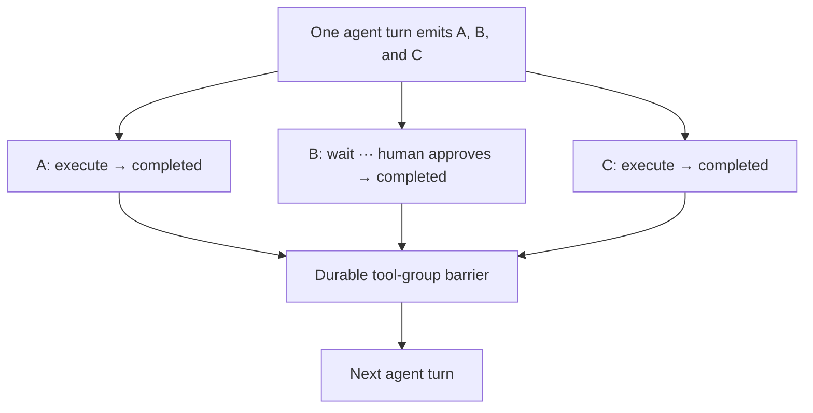

# Actant

Actant is a durable Python agent runtime built on
[Temporal](https://temporal.io/). Define agents and tools normally; Actant
handles parallel tools, human approval, deferred work, subagents, suspension,
and crash-safe continuation.

https://github.com/user-attachments/assets/021014df-4af6-47fe-8da9-cd6221008604

> Actant is pre-1.0. Public APIs may change.

## Why Actant

Agent tools become a distributed-systems problem when calls run in parallel,
wait for people, or outlive a worker. Actant handles that orchestration:

- allowed tools execute concurrently;
- deferred tools pause without holding a worker;
- the next model turn waits for the complete tool group;
- approvals and nested-agent waits surface through the same API;
- Temporal recovers execution after process or worker failure;
- projection stores keep state easy for APIs and UIs to read.



Read [Why Actant?](docs/why-actant.md) for the detailed guarantees and
framework comparison.

## Install

```bash
pip install actant
pip install "actant[openai]"     # optional provider
pip install "actant[anthropic]"  # optional provider
pip install "actant[gemini]"     # optional provider
```

Start a local Temporal development server:

```bash
actant server start
```

The server stays attached so its logs and lifecycle remain visible. Pass
`--detach` only when you intentionally want it to run in the background.

## Quickstart

This complete example streams tokens and then prints the persisted final
response:

```python
import asyncio
from contextlib import suppress
from uuid import uuid4

from actant import AgentDefinition
from actant.llm.providers.fake import FakeLLM, FakeResponse
from actant.runtime import AgentRuntime, TemporalRuntimeConfig, TemporalRuntimeWorker
from actant.runtime.stores import InMemoryRuntimeStores
from actant.tools import ToolRegistry

stores = InMemoryRuntimeStores()
config = TemporalRuntimeConfig(address="localhost:7233")


agent = AgentDefinition(
    id="assistant",
    name="Assistant",
    persona="You are a useful assistant.",
    llm=FakeLLM(
        [
            FakeResponse(
                text="Hello from Actant.",
                text_chunks=["Hello ", "from ", "Actant."],
            )
        ]
    ),
    tools=ToolRegistry([]),
)
agents = {agent.id: agent}

runtime = AgentRuntime(stores=stores, agents=agents, temporal=config)
worker = TemporalRuntimeWorker(stores=stores, agents=agents, config=config)


async def observe(thread):
    async for event in thread.events():
        if event.type == "text_delta" and event.text:
            print(event.text, end="", flush=True)
        elif event.type == "assistant_message":
            return event.text
        elif event.type == "error":
            raise RuntimeError(str(event.data.get("message", "agent failed")))


async def main() -> None:
    worker_task = asyncio.create_task(worker.run())
    try:
        thread = runtime.thread(agent.id, uuid4())
        observer_task = asyncio.create_task(observe(thread))
        await asyncio.sleep(0)  # start the live subscription before sending
        print("Streaming: ", end="", flush=True)
        await thread.send("hello")
        response = await asyncio.wait_for(observer_task, timeout=60)
        print(f"\nFinal: {response}")
    finally:
        worker_task.cancel()
        with suppress(asyncio.CancelledError):
            await worker_task


asyncio.run(main())

# Streaming: Hello from Actant.
# Final: Hello from Actant.
```

`thread.send()` durably submits work and returns immediately. `thread.events()`
provides typed live deltas and lifecycle events; `thread.messages()` provides
the persisted reload path. Custom hooks and listeners remain available for
advanced worker-side callbacks.

The runtime has three write-side entry points:

```python
thread = runtime.thread(agent.id, uuid4())
await thread.send("Start")
await thread.resolve(tool_call_id, approved=True)
await thread.cancel()
```

The equivalent runtime-level methods remain available when an application
already carries `agent_id` and `thread_id` separately. A thread handle also
exposes `state()`, `messages()`, `waiting_tools()`, and typed live `events()`.

Use `OpenAIProvider`, `AnthropicProvider`, `GeminiProvider`, or `QwenProvider`
in place of `FakeLLM`. Actant never chooses a model ID for you.

## Tools and approvals

Annotated functions become tools directly:

```python
from actant import tool


@tool
async def weather(city: str) -> dict[str, str]:
    """Get the current weather for a city."""
    return {"city": city, "forecast": "sunny"}


@tool(approval="Publish {title}?")
async def publish(title: str) -> dict[str, str]:
    """Publish an update."""
    return {"published": title}
```

Register them with `ToolRegistry([weather, publish])`. Actant derives the JSON
schema from annotations. Approval tools enter the same durable WAIT state as
advanced deferred tools and execute only after `thread.resolve(...,
approved=True)`.

## Demo

The included FastAPI + React viewer demonstrates streaming, approvals,
multiple-choice questions, mixed parallel tools, and nested subagents without
an API key:

```bash
just demo-sync
just demo
```

Open `http://localhost:5173`.

## Documentation

- [Core concepts](docs/concepts.md)
- [Runtime architecture](docs/architecture.md)
- [Runtime and deployment](docs/actant-runtime-guide.md)
- [Tools and approvals](docs/tools-guide.md)
- [Pauses and deferred work](docs/pauses-and-resume.md)
- [Subagents](docs/subagents.md)
- [Application coordinators](docs/coordinator-guide.md)
- [Release process](docs/releasing.md)

## Development

```bash
just sync
just test
just lint
just typecheck
just package
```

The `justfile` is repository-only. Installed users receive the `actant` CLI;
run `actant server --help` for local Temporal commands.

## License

[MIT](LICENSE)
