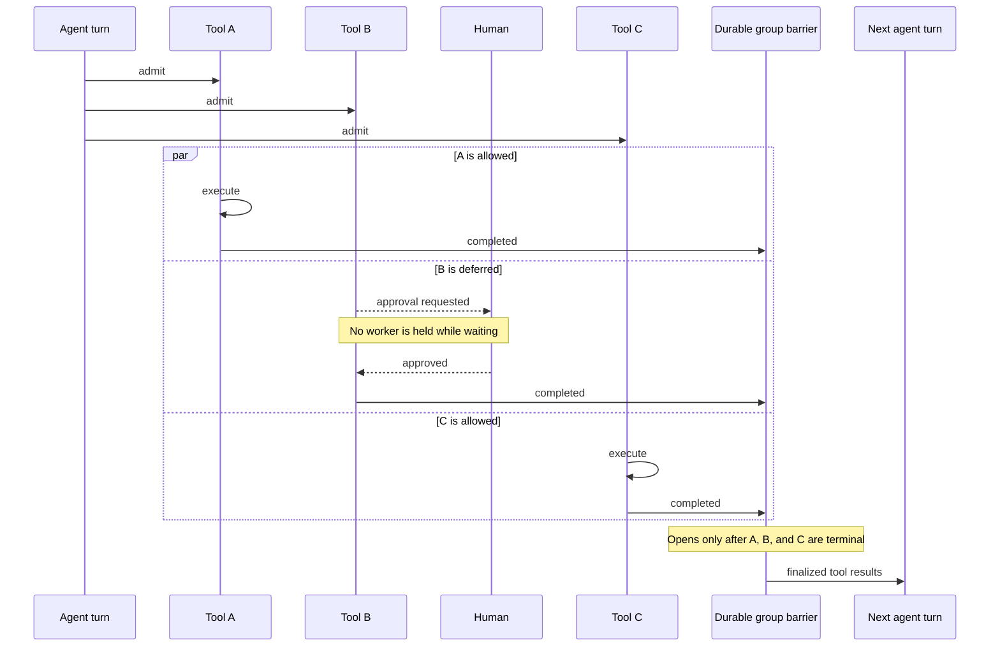

# Actant

Actant is a durable Python agent runtime built on
[Temporal](https://temporal.io/). Define agents and tools normally; Actant
automatically handles parallel tool execution, deferred calls, human
approvals, nested agents, durable suspension, and crash-safe continuation.

The package is intentionally domain-neutral. Applications provide
agents, tools, domain context, and UI.

> Actant is under active development. Public APIs may change before 1.0.

**[Read the Actant documentation →](docs/README.md)**

## Why Actant

Building an agent run is easy. Making it correct when several tools run in
parallel, one needs a human response, another finishes immediately, a worker
restarts, and a nested agent also pauses is a distributed-systems problem.

Actant makes that orchestration the runtime's job instead of application code:

- no custom pause/resume state machine;
- no polling loop or process held open for human approval;
- no manual serialization and reconstruction of interrupted runs;
- no hand-written fan-out/fan-in barrier for parallel tool calls;
- no separate orchestration path for nested agents;
- no custom worker-restart or duplicate-resolution reconciliation.

When one agent turn emits multiple tool calls, Actant admits every call
independently, runs eligible calls concurrently, parks only calls awaiting
external input, and starts the next agent turn only after the entire group is
terminal. That invariant survives processes, workers, restarts, and long human
delays.

Underneath that simple contract:

- one Temporal workflow owns each `(agent_id, thread_id)`;
- messages arrive through a durable inbox, including while work is active;
- tool admission is explicit: `ALLOW`, `BLOCK`, or `WAIT`;
- waiting calls can pause for human or external resolution without holding a
  Python process open;
- threads, runs, messages, and tool calls remain readable through
  application-owned projections;
- subagents use the same governed tool-call and deferred-resolution model.

Temporal owns coordination, stores own readable projections, and applications
own domain behavior.

Other frameworks provide graphs, interrupts, deferred-result objects, or
durable-execution integrations. Actant provides the finished orchestration
contract. Read [Why Actant?](docs/why-actant.md) for the detailed guarantees,
tradeoffs, and an honest comparison with adjacent frameworks.

## The Contract in One Picture



Immediate work does not wait to start. Deferred work consumes no Python worker
while parked. The model does not receive a partial tool group.

## See the Runtime

The included viewer demonstrates streaming turns, approvals, multiple-choice
questions, and two-level subagent delegation. It works without an API key by
using a deterministic local model:

```bash
just demo-sync
just demo
```

Then open `http://localhost:5173`. See [`examples/`](examples/) for the demo
architecture and prompts.

## Installation

Install Actant with the provider SDKs your application uses:

```bash
pip install "actant[openai]"
pip install "actant[anthropic]"
pip install "actant[gemini]"
pip install "actant[qwen]"
```

The provider-neutral runtime can be installed with `pip install actant`.

## Provider Adapters

With uv, install only the SDKs you need:

```bash
uv add --extra openai actant
uv add --extra anthropic actant
uv add --extra gemini actant
uv add --extra qwen actant
uv add actant
```

Supported adapters:

- `OpenAIProvider` for OpenAI Responses API completions
- `AnthropicProvider` for Anthropic Messages API completions
- `GeminiProvider` for Gemini `generate_content`
- `QwenProvider` for DashScope's OpenAI-compatible endpoint

You can route by model prefix:

```python
import os

from actant.llm import llm_for_model

llm = llm_for_model(os.environ["ACTANT_MODEL"])
```

Actant treats model IDs as provider configuration and does not choose a
"latest" model on your behalf.

## Run an Agent

The two runtime objects have different jobs:

- `AgentRuntime` is the client facade. APIs and application code use it to
  send messages, cancel threads, resolve waiting tools, and query live state.
- `TemporalRuntimeWorker` is the execution host. It is a long-running process
  that polls Temporal and performs model calls, tool calls, persistence, and
  hooks.

This minimal example runs both roles in one process, prints token deltas as
they arrive, and then accesses the complete persisted response. Start the
local Temporal development server first, then run the script:

```bash
actant server start --detach
```

```python
import asyncio
import os
from contextlib import suppress
from uuid import uuid4

from actant import AgentDefinition
from actant.llm import llm_for_model
from actant.llm.messages import Message
from actant.llm.providers.fake import FakeLLM, FakeResponse
from actant.runtime import (
    AgentRuntime,
    TemporalRuntimeConfig,
    TemporalRuntimeWorker,
)
from actant.runtime.events import AgentThreadHooks, StreamListener
from actant.runtime.stores import InMemoryRuntimeStores
from actant.tools import ToolRegistry

stores = InMemoryRuntimeStores()
llm = (
    llm_for_model(os.environ["ACTANT_MODEL"])
    if os.getenv("ACTANT_MODEL")
    else FakeLLM(
        [
            FakeResponse(
                text="Hello from Actant.",
                text_chunks=["Hello ", "from ", "Actant."],
            )
        ]
    )
)
responses: asyncio.Queue[Message | Exception] = asyncio.Queue()


class ConsoleHooks(AgentThreadHooks):
    async def on_assistant_message(self, message: Message) -> None:
        # A turn containing tool calls is not the final agent response.
        if not message.tool_calls:
            await responses.put(message)

    async def on_error(self, error: Exception) -> None:
        await responses.put(error)


class ConsoleStream(StreamListener):
    async def on_text_delta(self, delta: str) -> None:
        print(delta, end="", flush=True)


agent = AgentDefinition(
    id="assistant",
    name="Assistant",
    persona="You are a useful assistant.",
    llm=llm,
    tools=ToolRegistry([]),
)

runtime = AgentRuntime(
    stores=stores,
    agents={agent.id: agent},
    temporal=TemporalRuntimeConfig(address="localhost:7233"),
)
worker = TemporalRuntimeWorker(
    stores=stores,
    agents={agent.id: agent},
    config=TemporalRuntimeConfig(address="localhost:7233"),
    hooks_factory=lambda _thread: ConsoleHooks(),
    listener_factory=lambda _thread: ConsoleStream(),
)


async def ask(prompt: str) -> Message:
    """Submit one run and return its final assistant message."""
    thread_id = uuid4().hex
    await runtime.send_message(agent.id, thread_id, prompt)

    response = await asyncio.wait_for(responses.get(), timeout=60)
    if isinstance(response, Exception):
        raise response
    return response


async def main() -> None:
    worker_task = asyncio.create_task(worker.run())
    try:
        print("Streaming: ", end="", flush=True)
        response = await ask("hello")
        print()

        # Unlike the deltas above, this is the complete persisted response.
        # Return it from an API, publish it, or display it directly.
        print(f"Final: {response.content}")
    finally:
        worker_task.cancel()
        with suppress(asyncio.CancelledError):
            await worker_task


asyncio.run(main())

# Output:
# Streaming: Hello from Actant.
# Final: Hello from Actant.
```

Actant represents IDs as strings at the Temporal and storage boundaries. Use
UUIDs (or another globally unique scheme) for thread and application-generated
IDs; human-readable strings such as `agent.id` are appropriate for stable
registered agent names.

The important line is `response = await ask("hello")`: `response` is the final
provider-neutral `Message`, and `response.content` is the value normally sent
to a UI or returned by an API. `ConsoleStream.on_text_delta()` receives the
incremental text used to update a UI while that final response is still being
generated.

`send_message()` itself returns after signaling Temporal because an agent run
may pause and outlive the submitting request. `AgentThreadHooks` delivers
completed, persisted assistant messages. `StreamListener` separately delivers
live text, thinking, and tool-argument deltas while each model turn is running.
The durable reload path is
`stores.messages.list_for_thread(agent.id, thread_id)`.

In production, hooks and stream listeners normally publish these events to an
SSE/websocket channel instead of an in-process queue; the included viewer shows
that complete path. Run workers independently from API/client processes and
use shared durable stores. Temporal load-balances workflow and activity tasks
across every worker polling the same task queue.

## Execution Anatomy

`AgentThreadWorkflow`:

- **Agent thread** = the durable, addressable lifetime of the conversation. It remains
  addressable and parks on `wait_condition(inbox)` while idle.
- **Agent run** = one end-to-end activation caused by draining pending inbound
  messages. It advances through agent turns and their tool groups until a stop
  condition is reached.
- **Agent turn** = one `run_turn` activity invocation: a single model call and
  the assistant output it produces.
- **Tool fan-out** = parallel `admit_tool` activities, followed by
  `execute_tool` for allowed calls or `await_external_resolution` for
  deferred calls. Deferred calls park as Temporal async activities, not
  workflow signals.

## Cancel + Resolve

```python
# Cancel an in-flight thread
await runtime.cancel_thread(agent.id, thread_id)

# Resolve a deferred (WAIT) tool call
await runtime.resolve_deferred_tool_call(
    agent.id,
    thread_id,
    tool_call_id,
    approved=True,
    answer="ok",
)

# Read live state without disturbing the workflow
state = await runtime.get_state(agent.id, thread_id)
```

## Tool Admission

Tools can decide whether a requested call can execute immediately. Most
tools don't define admission logic and run by default. A tool that
needs approval, consensus, a timer, or another external condition can
implement `can_execute` and return `allow`, `block`, or `wait`:

```python
from actant.tools import ToolDecision, ToolWaitRequest


async def can_execute(self, call, invocation, context):
    if await approval_store.approved(call.id):
        return ToolDecision.allow()
    return ToolDecision.wait(
        ToolWaitRequest(
            kind="human_review",
            prompt="waiting for human review",
            payload={"tool_call_id": call.id},
        )
    )
```

The `admit_tool` activity records WAITING calls and emits an
`on_tool_waiting` hook. Resolve via `runtime.resolve_deferred_tool_call`, which
completes the parked Temporal async activity after persisting the
resolved tool result.

## Runtime Stores

`actant.runtime.stores` ships projection-only stores. Coordination
(durable inbox, single-writer per thread, work scheduling) lives in
Temporal — these stores hold the readable side of runtime state.

In-memory variants for tests/local dev:
- `InMemoryRuntimeStores` — drop-in for the projection contracts.

Postgres backend:
- `actant.runtime.stores.postgres` — DeclarativeBase models +
  `ACTANT_RUNTIME_METADATA` you can plug into your own Alembic setup.

Tables: `actant_threads`, `actant_runs`, `actant_messages`,
`actant_message_parts`, and `actant_tool_calls`.

Applications can implement custom stores against the contracts in
`actant.runtime.interfaces.stores`.

## Subagents

Subagent invocation is represented as a normal tool. Register `TaskTool`
when an agent is allowed to delegate work:

```python
from actant.tools import InMemorySubagentRegistry, TaskTool, ToolRegistry

registry = InMemorySubagentRegistry({"researcher": researcher_invoker})
tools = ToolRegistry([TaskTool(invoker=registry)])
```

The invoker is app-owned, so a subagent can be another Actant
coordinator, a remote worker, a durable workflow, or a test double.

## Hooks

`AgentThreadHooks` exposes async callbacks fired from inside activities
for live delivery and observability:

- user/assistant messages
- turn start
- text/thinking deltas (via `StreamListener`)
- tool calls, tool results, waiting calls, resolved calls
- completion and errors

Hooks announce; they don't write. The canonical state lives in the
stores. Apps wire hooks to their pubsub/SSE/websocket layer of choice
via `PublishingThreadHooks` / `PublishingStreamListener` or custom
implementations.

## Examples

See `examples/` for runnable compositions of agents, tools, admission, and
delegation. `examples/demo/` is the worked FastAPI + React demo.

For apps that need multiple agents, `task()`-style delegation, or
robust state recovery when Temporal and the store diverge, read
[`docs/coordinator-guide.md`](docs/coordinator-guide.md). The
`examples/demo/` directory ships a worked example (`DemoCoordinator`)
that uses the framework's coordinator primitives.

## Documentation

Start with the [documentation map](docs/README.md):

- [why Actant and how it differs](docs/why-actant.md)
- [core concepts](docs/concepts.md)
- [runtime architecture and implementation map](docs/architecture.md)
- [runtime and deployment](docs/actant-runtime-guide.md)
- [tools and admission](docs/tools-guide.md)
- [pauses and deferred work](docs/pauses-and-resume.md)
- [subagents](docs/subagents.md)
- [application coordinators](docs/coordinator-guide.md)

## Local Development

```bash
just sync                  # install development + provider dependencies
just server start --detach # start the packaged local Temporal server
just test                  # run tests (uses in-memory WorkflowEnvironment)
just temporal-smoke        # full docker round-trip
```

The `justfile` is for contributors working from this repository; it is not
installed by the wheel. Package users get the `actant` CLI instead:

```bash
actant server start --detach
actant server status
actant server logs --follow
actant server stop
actant server reset  # also deletes local Temporal data
```

These commands manage a Docker-backed Temporal server for local development,
not a production Actant control plane. Production applications point
`TemporalRuntimeConfig` at their independently operated Temporal service.

The local server is configurable rather than mandatory. Ports have flags and
environment-variable equivalents, `--no-ui` omits the UI, and teams can supply
their own Compose stack or compatible Compose command:

```bash
actant server start --detach --port 17233 --ui-port 18233
actant server start --detach --no-ui
actant server start --detach \
  --compose-file ./temporal.yml \
  --project-name my-temporal \
  --compose-command "podman compose"
```

The corresponding environment variables are `ACTANT_TEMPORAL_PORT`,
`ACTANT_TEMPORAL_UI_PORT`, `ACTANT_SERVER_COMPOSE_FILE`,
`ACTANT_SERVER_PROJECT`, and `ACTANT_SERVER_COMPOSE_COMMAND`. The bundled stack
also accepts `ACTANT_TEMPORAL_IMAGE`, `ACTANT_TEMPORAL_UI_IMAGE`, and
`ACTANT_TEMPORAL_POSTGRES_IMAGE` image overrides.

Release maintainers can follow the [release checklist](docs/releasing.md).
User-facing changes are recorded in the [changelog](CHANGELOG.md).

## License

Actant is released under the [MIT License](LICENSE).
